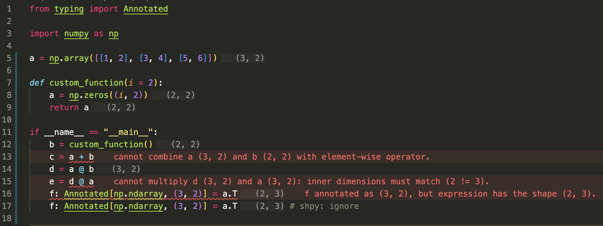

# shpy

[](https://github.com/jiaquan-cheng/shpy/actions/workflows/ci.yaml)

A lightweight static analyzer for tracking and validating NumPy tensor shapes without running the code. 

## VS Code Extension

### Preview

The VS Code extension provides real-time shape inference and error messages.



### Installation

It is not yet published on VS Code Marketplace. To install the extension, clone the repository, install the package and build the VS Code extension:

```bash
git clone https://github.com/jiaquan-cheng/shpy.git
cd shpy
pip install -e .
make vscode-package
```
This compiles a `.vsix` file in the `shpy-vscode` directory, which you can install as an extension in VS Code.

## Terminal

### Installation

Prerequisites: Python 3.13+

To install `shpy` directly:

```bash
pip install git+https://github.com/jiaquan-cheng/shpy.git
```

### Usage

```bash
shpy path/to/your/file_or_directory
```

You can use the `--show-shapes` flag to display the inferred shapes of all expressions in the code:
```bash
shpy path/to/your/file_or_directory --show-shapes
```

## Features
- Infers shapes from NumPy array (`np.array([1, 2, 3])`) and NumPy functions (`np.zeros((3, 2))`, `a.T`).
- Validates shape annotations for NumPy arrays (`c: Annotated[np.ndarray, (3, 2)]`).
- Validates NumPy operations for shape compatibility (`a + b`, `a @ b`).
- Infers shapes for simple functions calls and function bodies (`c = custom_func(a, b)`).
- Tracks scalar variables used in shape definitions (`np.zeros((dim, 2))`).

Checkout `examples/demo.py` for a more comprehensive demonstration of `shpy`'s capabilities.

## Limitations
- Only supports a subset of NumPy arrays and functions.
- Since shape inference for NumPy function is hard-coded, it may produce incorrect results for some functions.
- No support for dynamic shape inference (e.g., shapes that depend on runtime values).
- No control flow support (if, for, while).
- No support for nested/recursive function definitions.
- False negatives: To keep development simple,`shpy` identifies functions by suffix, so it may not trigger an error in cases like (`var.expand_dims` without `np.` prefix). 

If you noticed any bugs or have any feature requests, please report them on [GitHub Issues](https://github.com/jiaquan-cheng/shpy/issues).

## Development

Prerequisites: Python 3.13+, [uv](https://docs.astral.sh/uv/)

To get started locally:
```bash
git clone https://github.com/jiaquan-cheng/shpy.git
cd shpy
make setup
```

We would recommend to using the VS Code extension or the `--show-shapes` flag to check the inferred shapes of your code while developing.

- `make` : Runs the test suite and quality checks.
- `make lint` : Runs [Ruff](https://docs.astral.sh/ruff/) and [Mypy](https://mypy-lang.org/) for code quality and type safety.
- `make format` : Auto-format code.
- `make test` : Runs [Pytest](https://pytest.org/).
- `make clean` : Cleans up the project by removing build artifacts and caches.